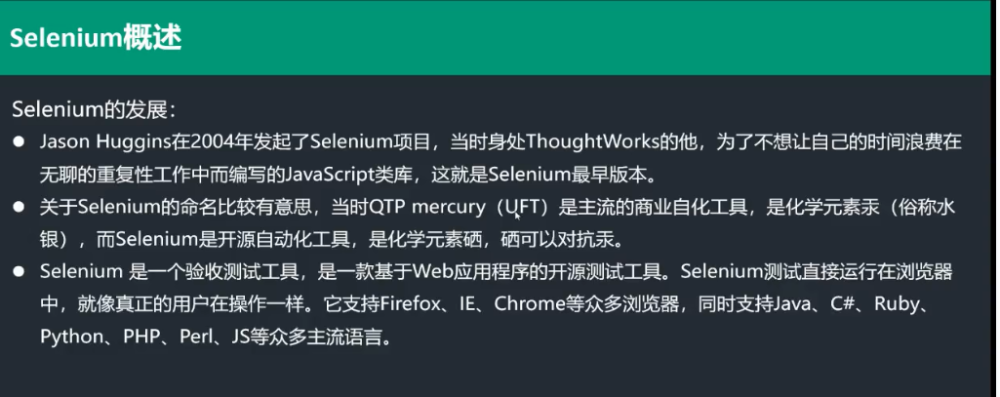
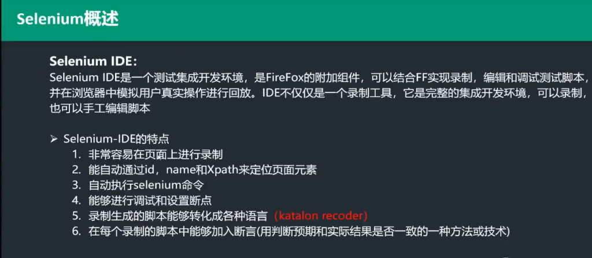
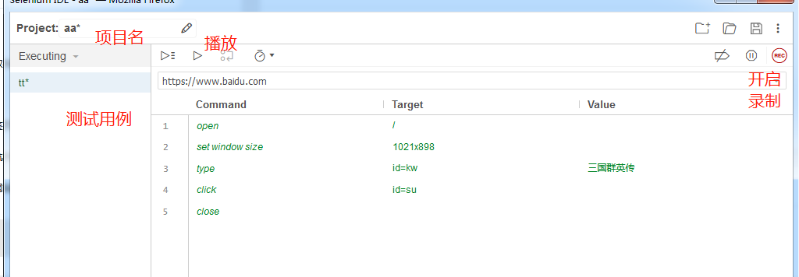
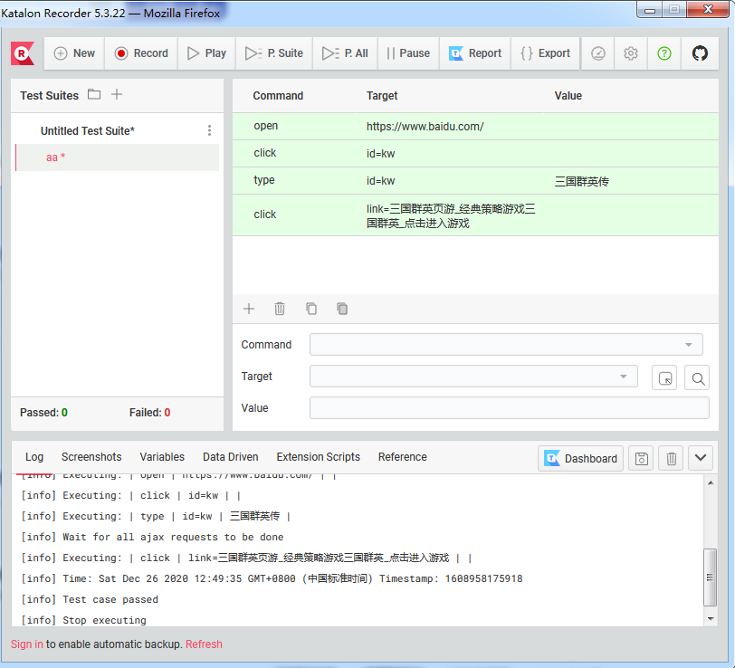
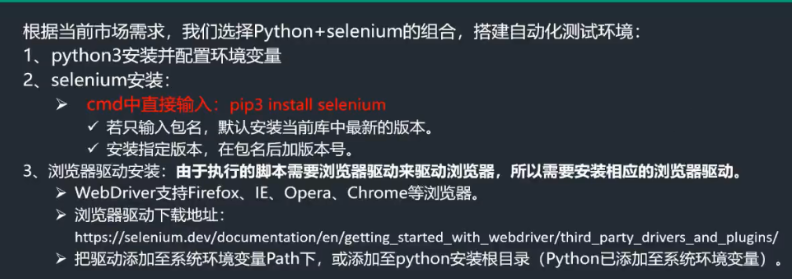
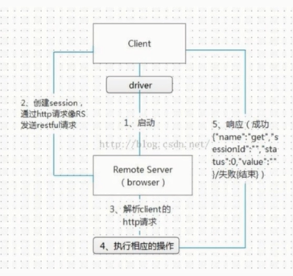
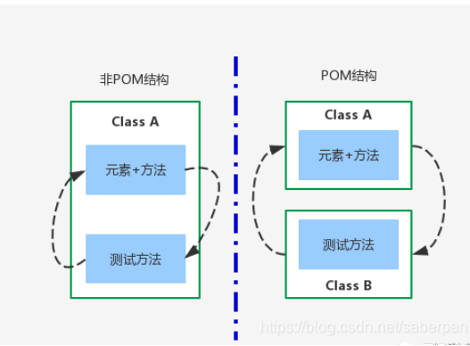
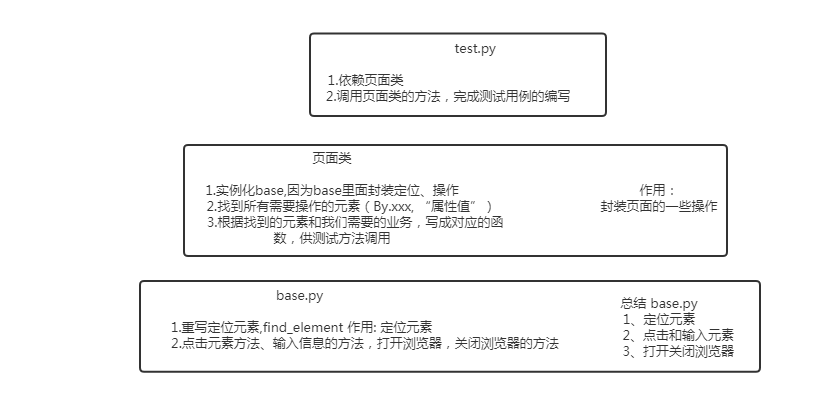
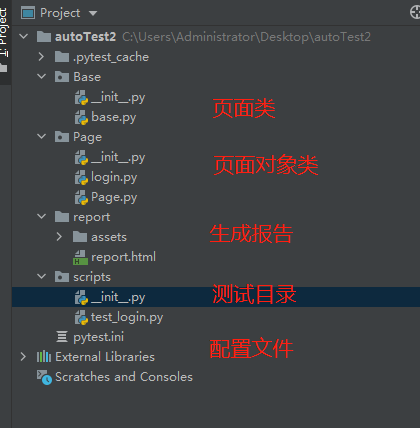

# web ui自动化测试的学习与分享

### 自动化测试概述

自动化测试是以人为驱动的测试行为转为机器执行的过程，即模拟手工测试，通过执行测试脚本自动地测试软件；

通常，在执行了自动化测试用例并通过评审之后，由测试人员根据测试用例中描述的一步步编写脚本并执行测试，得到实际结果与预期结果的比较。在此过程中，为了节约时间或硬件资源，提高测试效率，便引入了自动化测试的概念。

总之一句话：自动化测试就是用程序（脚本）测试程序

####    

手工测试局限性：

- 覆盖性：主要是无法覆盖所有的代码路径
- 时效性：短时间内无法完成大量测试用例的执行工作
- 重复性：回归测试具有一定的机械性、重复性，工作量往往比较大

### 自动化测试的优势

- 对回归测试方便
- 测试具有一致性和可重复性，自动化的一个明显的好处是可以在较少的时间内运行更多的测试。
- 有效的利用人力物力资源，提高测试工作效率
- 将繁琐的重复任务自动化，可以提高准确性和测试人员的积极性，可以让测试人员专注于手工测试部分，提供手工测试的效率

### 自动化测试的劣势

- 自动化测试是工具执行，没有思维，无法进行主观判断，对界面色彩、布局和系统的奔溃现象无法发现，这些错误通过人眼是很容易发现的。
- 自动化测试工具本身是一个产品，在不同德系统平台或硬件平台可能会受影响，在运行时可能影响被测程序德测试结果。
- 对于需求更改频繁的软件，测试脚本的维护和设计比较困难。
- 自动化测试是机器执行，发现的问题要比手工测试要少很多，通过测试工具没有发现缺陷，并不能说明系统不存在缺陷，只能通过工具评判测试结果和预期效果之间的差距。
- 自动化测试要编写测试脚本，设计场景，这些对测试人员的要求比较高，测试的设计直接影响测试的结果


 

### Selenium概述




#### 入门工具  selenium IDE  && katalon



selenium IDE: UI用户界面的脚本录制工具（不用写脚本，只需要点点点就能生成脚本），但是处理的逻辑有限，对于负责的脚本处理起来比较麻烦。适用于刚入门，不会写代码，可以录制简单的脚本，亦或者可以使用其录制一个基本的脚本，然后去修改其逻辑，采用的关键字驱动的方式进行脚本开发。




katalon:  和selenium IDE类型的工具，可以导出python+unittest的脚本




#### selenium环境配置




**Chrome**

点击下载chrome的webdriver： http://chromedriver.storage.googleapis.com/index.html

**Firefox**

Firefox驱动下载地址为：https://github.com/mozilla/geckodriver/releases

**IE**

IE浏览器驱动下载地址为：http://selenium-release.storage.googleapis.com/index.html


#### selenium工作原理




#### 页面元素定位及操作

| webDriver元素定位方式 | 对应的python方法                    |
| :-------------------- | ----------------------------------- |
| id                    | find_element_by_id                  |
| name                  | find_element_by_name                |
| class name            | find_element_by_class_name()        |
| tag name              | find_element_by_tag_name()          |
| link text             | find_element_by_link_text()         |
| partial link text     | find_element_by_partial_link_text() |
| xpath                 | find_element_by_xpath               |
| css selector          | find_element_by_css_selector()      |

selenium+python 中文文档  https://python-selenium-zh.readthedocs.io/zh_CN/latest/


```html
<button id='btn' class='btn_style' name='anniu'>按钮</button>
```


#### 例子演示1

```python
from selenium import webdriver
from time import sleep
import random

driver = webdriver.Chrome()

driver.maximize_window()
driver.get('http://119.29.235.245:9003/index.php/user/login')
driver.find_element_by_id('inputAccount').send_keys('zerong.zhang')
driver.find_element_by_id('inputPassword').send_keys('RK0A9ICT')
driver.find_element_by_id('remember').click()
sleep(2)
driver.find_element_by_xpath('/html/body/div/form/button').click()
sleep(2)

driver.find_element_by_partial_link_text('系统邮件').click()
sleep(2)

driver.find_element_by_id('user_area').send_keys('测试数据玩家')
driver.find_element_by_name('mail_title_1').send_keys('测试标题1')
driver.find_element_by_id('from_1').send_keys('测试收件人')
driver.find_element_by_id('mail_out_content_1').send_keys('邮件缩略正文11')
driver.find_element_by_id('mail_content_1').send_keys('邮件正文11')
driver.find_element_by_id('sendtime').send_keys('邮件正文11')

sleep(2)
tr_id = random.randint(2, 5)
td_id = random.randint(1, 7)

xpath_url = f"/html/body/div[2]/div[1]/div[2]/table/tbody/tr[{tr_id}]/td[{td_id}]"

driver.find_element_by_xpath(xpath_url).click()
driver.find_element_by_xpath('/html/body/div[2]/div[3]/div/button[1]').click()

sleep(4)
driver.find_element_by_id('item_num').send_keys('20')
driver.find_element_by_xpath('//*[@id="mail_form"]/div/div[2]/div/div[2]/div/div[2]/div[1]/button').click()


sleep(2)
driver.find_element_by_xpath('//*[@id="mail_form"]/div/div[2]/div/div[2]/div/div[2]/div[1]/div/button').click()

item_li_num = random.randint(1, 20)
item_count = random.randint(1, 20000)
xpath_item_li_xpath = f'//*[@id="mail_form"]/div/div[2]/div/div[2]/div/div[2]/div[1]/div/div/ul/li[{item_li_num}]/a'
driver.find_element_by_xpath(xpath_item_li_xpath).click()
driver.find_element_by_id('item_num').send_keys(item_count)
driver.find_element_by_xpath('//*[@id="mail_form"]/div/div[2]/div/div[2]/div/div[2]/div[1]/button').click()
sleep(4)


driver.execute_script("setTimeout( ()=> confirm('javascript确认框'),2000)")
```


#### 例子演示2

```python
from selenium import webdriver
import random
from time import sleep

class TestKeyWord(object):

    # 初始化
    def __init__(self, browser_type, url):
        self.driver = self.open_browser(browser_type)
        self.driver.get(url)
        self.driver.maximize_window()

    # 判断浏览器类型
    def open_browser(self, browser_type):
        if browser_type == 'chrome':
            self.driver = webdriver.Chrome()
            return self.driver
        elif browser_type == 'firefox':
            self.driver = webdriver.Firefox()
            return self.driver
        else:
            print('error')

    # 元素定位
    def locator(self, locator_type, value):
        if locator_type == 'id':
            return self.driver.find_element_by_id(value)
        elif locator_type == 'xpath':
            return self.driver.find_element_by_xpath(value)
        elif locator_type == 'linkText':
            return self.driver.find_element_by_partial_link_text(value)
        else:
            return self.driver.find_element_by_name(value)

    # 输入
    def input_text(self, locator_type, value, text):
        self.locator(locator_type, value).send_keys(text)

    # 点击
    def click_element(self, locator_type, value):
        self.locator(locator_type, value).click()

    # 释放资源
    def close_browser(self):
        self.driver.quit()

    # 随机数
    def random_int(self, start, end):
        return random.randint(start, end)

    # 隐式等待
    '''
    显式等待：就是明确的要等到某个元素的出现或者是某个元素的可点击等条件，等不到，就一直等，
            在规定的时间之内都没找到，则跳出Exception
    隐式等待：得不到某个元素就等待一段时间，直到拿到某个元素位置。
            可以理解成在规定的时间范围内，浏览器在不停的刷新页面，直到找到相关元素或者时间结束。
    '''

    def wait_time(self, time):
        self.driver.implicitly_wait(time)


if __name__ == '__main__':
    # 登录
    tk = TestKeyWord('chrome', 'http://119.29.235.245:9003/index.php/user/login')
    tk.input_text('id', 'inputAccount', 'zerong.zhang')
    tk.input_text('id', 'inputPassword', 'RK0A9ICT')
    tk.click_element('id', 'remember')
    tk.click_element('xpath', '/html/body/div/form/button')
    tk.wait_time(10)
    sleep(2)

    tk.click_element('linkText', '系统邮件')
    tk.input_text('id', 'user_area', '测试数据玩家')
    tk.input_text('name', 'mail_title_1', '测试标题1')
    tk.input_text('id', 'from_1', '测试收件人')
    tk.input_text('id', 'mail_out_content_1', '邮件缩略正文11')
    tk.input_text('id', 'mail_content_1', '邮件正文11')
    tk.wait_time(10)
    sleep(2)

    # 随机选择一个日期
    tk.click_element('id', 'sendtime')
  tk.click_element('xpath',f"/html/body/div[2]/div[1]/div[2]/table/tbody/tr[{tk.random_int(2, 5)}]/td[{tk.random_int(1, 7)}]")
    tk.click_element('xpath', '/html/body/div[2]/div[3]/div/button[1]')
    sleep(2)

    tk.input_text('id', 'item_num', tk.random_int(1, 100))
    tk.click_element('xpath', '//*[@id="mail_form"]/div/div[2]/div/div[2]/div/div[2]/div[1]/button')
    sleep(2)

    # 随机添加3件道具
    for i in range(3):
        tk.click_element('xpath', '//*[@id="mail_form"]/div/div[2]/div/div[2]/div/div[2]/div[1]/div/button')
        tk.click_element('xpath',
                         f'//*[@id="mail_form"]/div/div[2]/div/div[2]/div/div[2]/div[1]/div/div/ul/li[{tk.random_int(1, 20)}]/a')
        tk.input_text('id', 'item_num', tk.random_int(1, 1000))
        tk.click_element('xpath', '//*[@id="mail_form"]/div/div[2]/div/div[2]/div/div[2]/div[1]/button')
        sleep(2)

    tk.close_browser()

```


#### PO模式

测试页面和测试脚本分离，即页面封装类，供测试脚本调用

- 页面对象模型(PO)是一种设计模式,用来管理维护一组页面元素的对象库.
- 在PO下,应用程序的每一个页面都有一个对应的Page类.
- 每一个Page类维护着该页面的元素集和操作这些元素的方法.



##### PO的好处

代码可读性强      可维护性      复用性高


 在设计用例的时候，有些用例只是参数数据的输入不一样，比如登录这个功能，操作过程是一样的。如果用例重复去写操作过程会增加代码量，对应这种多组数据的测试用例，可以用数据驱动设计模式，一组数据对应一个测试用例，用例自动加载生成。

ddt要与unittest单元测试框架一起结合使用
@ddt 引入ddt模块
@data 导入数据
@unpack 拆分数据
@file_data导入外部数据


#### 例子演示3

```python
# page基类
from selenium import webdriver


class BasePage(object):

    # 构造函数
    def __init__(self, driver):
        self.driver = driver

    # 元素定位
    def locator(self, locator):
        return self.driver.find_element(*locator)

    # 关闭浏览器
    def close_browser(self):
        self.driver.close()

    # 打开浏览器
    def open_browser(self, url):
        self.driver.get(url)
        self.driver.maximize_window()


# 页面类

from basePage.base_page import BasePage
from selenium import webdriver
from selenium.webdriver.common.by import By
from time import sleep


class SearchPage(BasePage):
    # 搜索框
    input_id = (By.ID, 'kw')
    # 百度一下按钮
    click_id = (By.ID, 'su')

    # 输入数据
    def input_text(self, input_text):
        self.locator(self.input_id).send_keys(input_text)

    # 点击
    def click_element(self):
        self.locator(self.click_id).click()

    # 检查
    def check(self, url, input_text):
        self.open_browser(url)
        self.input_text(input_text)
        self.click_element()
        sleep(2)

# 测试类
from selenium import webdriver
import unittest
from ddt import data, ddt, unpack
from pageObject.search_page import SearchPage
from time import sleep


@ddt
class TestSearch(unittest.TestCase):

    # 前置条件
    def setUp(self) -> None:
        driver = webdriver.Chrome()
        self.sp = SearchPage(driver)

    # 后置条件
    def tearDown(self) -> None:
        self.sp.close_browser()

    @data(['https://www.baidu.com', 'selenium'], ['https://www.baidu.com', '三国群英传'])
    @unpack
    def test(self, url, input_text):
        self.sp.open_browser(url)
        self.sp.input_text(input_text)
        self.sp.click_element()
        sleep(2)


if __name__ == '__main__':
    unittest.main()


        
        

```




#### 最终整合




pytest： https://blog.csdn.net/lovedingd/article/details/98952868


```ini
# 命令行参数
[pytest] 
# 生成报告选项
addopts = -s --html=./report/report.html
# 测试路径
testpaths= ./scripts
# 搜索文件名
python_files = test_*.py
# 搜索测试类名
python_classes = Test_*
# 搜索测试方法名
python_functions = test_*
# 控制台实时输出日志
log_cli=1
```


```python
Base   base.py

from selenium.webdriver.support.wait import WebDriverWait


class Base:
    def __init__(self, driver):
        self.driver = driver

    def find_element(self, locator, timeout=10, poll=0.5):
        return WebDriverWait(self.driver, timeout, poll).until(lambda x: x.find_element(*locator))

    def click_element(self, locator):
        self.find_element(locator).click()

    def input_element(self, locator, text):
        ele = self.find_element(locator)
        ele.clear()
        ele.send_keys(text)

    def close_browser(self):
        self.driver.close()

    def open_browser(self, url):
        self.driver.get(url)
        self.driver.maximize_window()
        
Page __init__.py

from selenium.webdriver.common.by import By

'''
   登录页面
'''
# 用户框
user_id = (By.ID, 'inputAccount')
# 密码框
passwd_id = (By.ID, 'inputPassword')
# 勾选框
remember_id = (By.ID, 'remember')
# 登录按钮
login_button = (By.XPATH, '/html/body/div/form/button')

'''
   其他页面
'''


Page  Page.py
        
from Page.login import Login_Page


class Page_Obj:
    def __init__(self, driver):
        self.driver = driver

    def Login_Page(self):
        return Login_Page(self.driver)
    
Page  login.py

from selenium.webdriver.common.by import By

import Page
from Base.base import Base


class Login_Page(Base):
    def __init__(self, driver):
        Base.__init__(self, driver)

    # 输入用户名
    def input_user(self, input_text):
        self.input_element(Page.user_id, input_text)

    # 输入密码
    def input_passwd(self, input_text):
        self.input_element(Page.passwd_id, input_text)

    # 记住密码
    def remember_passwd(self):
        self.click_element(Page.remember_id)

    # 登录按钮
    def login(self):
        self.click_element(Page.login_button)

    # 登录流程
    def test_login(self, user, passwd):
        self.input_user(user)
        self.input_passwd(passwd)
        self.remember_passwd()
        self.login()


scripts  test_login.py


import sys, os
import pymysql as pymysql

sys.path.append(os.getcwd())

import pytest
from selenium import webdriver
from Page.Page import Page_Obj


def read_database():
    db = pymysql.connect(host='localhost', user='root', password='123456', database='user', port=3306,
                         charset='utf8')
    sql = 'select username, password from user'
    cursor = db.cursor()
    cursor.execute(sql)
    results = cursor.fetchall()
    db.close()
    cursor.close()
    print(results)
    return results


class Test_login:
    def setup(self):
        self.driver = webdriver.Chrome()
        self.lp = Page_Obj(self.driver).Login_Page()
        self.lp.open_browser('http://119.29.235.245:9003/index.php/user/login')

    def teardown(self):
        self.lp.close_browser()

    # @pytest.mark.parametrize("user,passwd", [('zerong.zhang', 'RK0A9ICT'), ('zzzzrr', '123456')])
    # def test_login(self, user, passwd):
    #     self.lp.test_login(user, passwd)
    #     expect_url = 'http://119.29.235.245:9003/index.php/home/welcome'
    #     current_url = self.driver.current_url
    #     assert expect_url == current_url

    @pytest.mark.parametrize("user,passwd", read_database())
    def test_login(self, user, passwd):
        self.lp.test_login(user, passwd)
        expect_url = 'http://119.29.235.245:9003/index.php/home/welcome'
        current_url = self.driver.current_url
        assert expect_url == current_url

```


#### 后续展望

优化测试报告 allure

jenkins来做持续集成

代码仓库 git

高级javascript 


​	